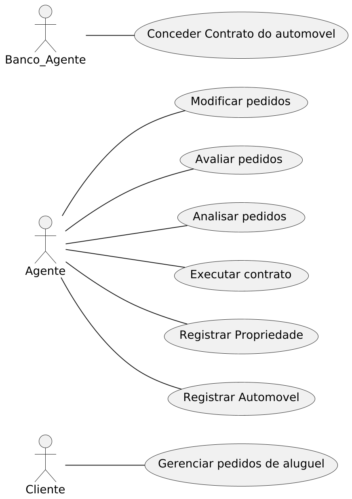
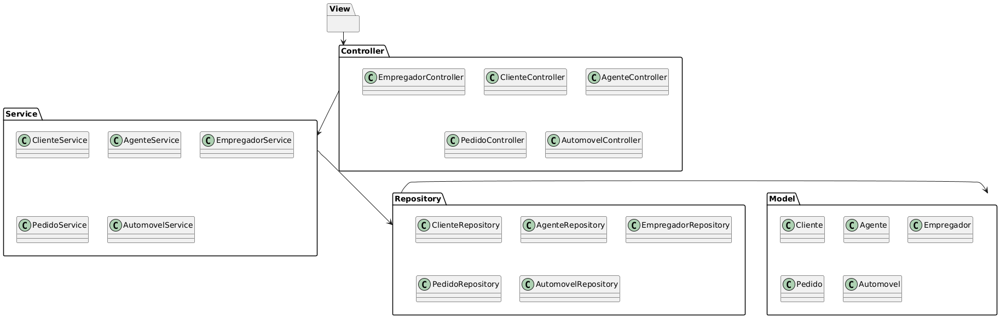
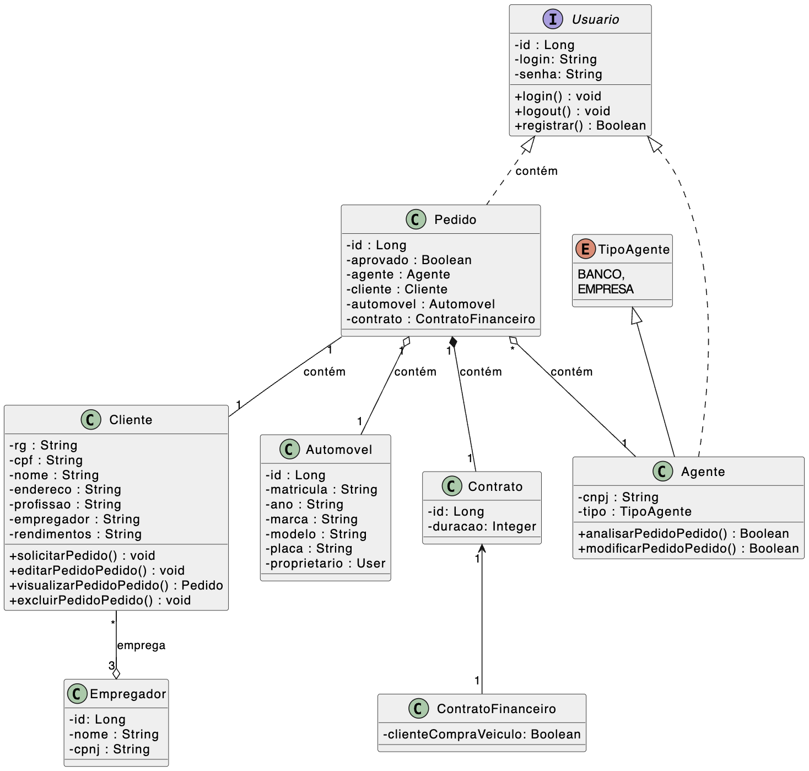

# Sistema de Aluguel de Carros

Este projeto é um protótipo de aplicação de sistema de aluguel de carros, desenvolvido em interface de linha de comando utilizando a linguagem Java.

Trata-se de um projeto acadêmico desenvolvido para a disciplina de Laboratório de Desenvolvimento de Software, do curso de Engenharia de Software da Pontifícia Universidade Católica de Minas Gerais (PUC Minas).

## Integrantes
* Gustavo Menezes Barbosa 
* Pedro Henrique Dias Camara 
* Milena Lara Reis Ferreira

## Orientadores
* Cristiano de Macêdo Neto 

## Descrição do Problema

O sistema só pode ser utilizado após cadastro prévio.

Os usuários individuais (clientes) podem introduzir, modificar, consultar e cancelar pedidos de aluguel. Por outro lado, os agentes (empresas e bancos) podem modificar e avaliar pedidos.

Após introdução no sistema, os pedidos são analisados do ponto de vista financeiro pelos agentes e, em caso de parecer positivo, são colocados à sua consideração para execução do contrato.

Sobre os contratantes do aluguel, armazenam-se os dados de identificação (RG, CPF, Nome, Endereço), profissão, as entidades empregadoras e os respectivos rendimentos auferidos (máximo 3).

Dependendo do tipo de contrato, os automóveis alugados podem ser registrados como propriedade dos clientes, empresas ou bancos.
Sobre os automóveis, o sistema registra a matrícula, ano, marca, modelo e placa.

O aluguel de um automóvel pode estar associado com um contrato de crédito, o qual foi concedido por um dos bancos agentes.

Em termos do sistema, o servidor central encontra-se ligado aos computadores locais dos clientes e aos diversos agentes aderentes através da Internet.

O sistema pode ser subdividido em dois subsistemas: um para gestão de pedidos e contratos; e outro para a construção dinâmica das páginas web.

## Diagrama de Caso de Uso

## Histórias de Usuário

Eu como cliente individual quero criar, modificar, atualizar e cancelar os pedidos para conseguir alugar meu veículo.

Eu como agente quero avaliar e modificar pedidos para gerenciar os alugueis possíveis, assim como registrar os automóveis. Alem disso, eu quero análisar as características financeiras dos pedidos e, se necessário, aprovar a execussão do contrato. Ademais, eu quero registrar os automóveis como propriedade, assim como seus dados de matrícula, ano, marca, modelo e placa.  

Eu como banco agente, quero conceder contratos de crédito para a associação com o aluguel de um automóvel. 

## Diagrama de Pacotes

## Diagrama de Componentes

## Diagrama de Classe

## Instruções de utilização

1 - Abra o diretório raiz do repositório no terminal de comando e execute o comando `cd ./project/code/aluguelDeCarros`

2 - Execute o comando `mvn spring-boot:run` para rodar o servidor.

3 - Abra o endereço `http://localhost:8080` no seu navegador de preferência.
